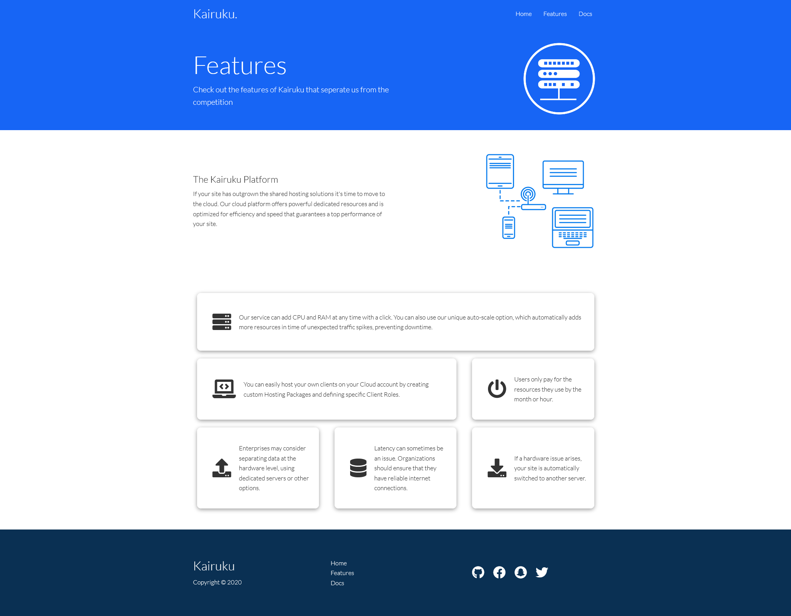

# kairuku.github.io

## Table of contents
* [General info]
* [Technologies]
* [Setup]

## General info
This project is a simple cloud hosting project with limited functionality. Created to demonstrate knowledge of HTML, CSS and Responsive Design.  
	
## Technologies
Project is created with:
* HTML: 5
* CSS : 3

<h1> Home Page<h1>


<h1> Features Page <h1>

	
## Setup
To run this project, download it locally then open the folder in your preferred IDE, open the node Terminal:

```
$ npm install -g live-server
$ live-server
```
